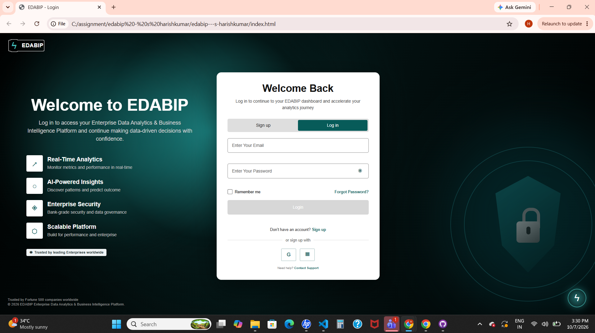

# EDABIP Login Screen

Enterprise Data Analytics & Business Intelligence Platform (EDABIP) Login Screen prototype.

## Assigned Screen

Login Screen

## Technologies Used

* HTML5
* CSS3
* JavaScript
* Visual Studio Code
* GitHub Desktop

## How to Run

1. Clone or download this repository.
2. Open the project folder.
3. Open `index.html` in a web browser.
4. The EDABIP Login Screen will be displayed.

No backend or installation is required.

## Screenshot

(screenshots/login(2).png),(screenshots/phone.png),(screenshots/tablet.png)

## Difficulties

The main difficulty was matching the Figma design using HTML and CSS while maintaining the correct layout, spacing, colours, and responsive behaviour across different screen sizes.

## Day 1 Progress

* Created the project structure.
* Created the HTML login screen structure.
* Added base CSS styling.
* Added responsive layout that works on desktop, tablet, and mobile.
* Added the initial JavaScript file.
* Added README documentation.
* Added the Day 1 screenshot.
